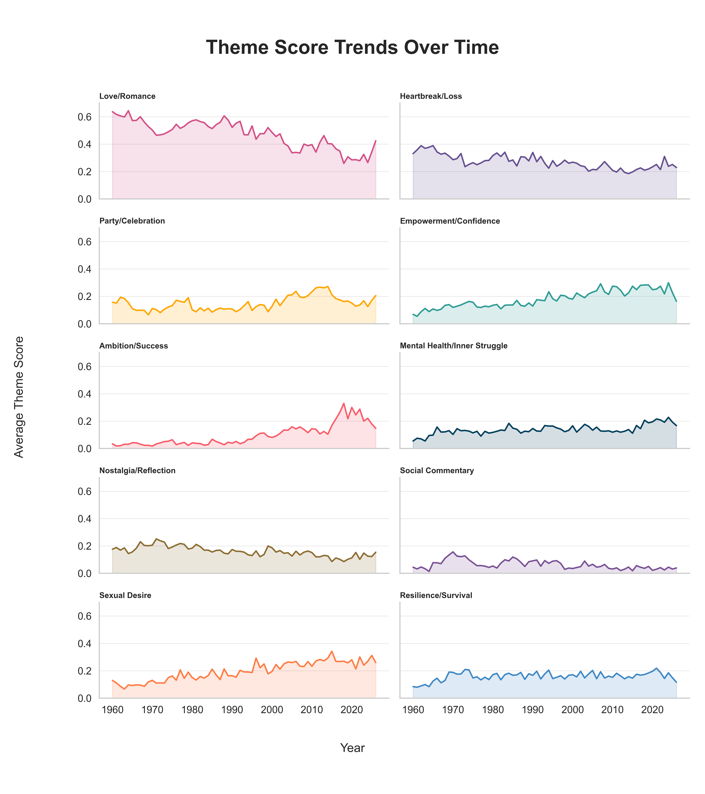
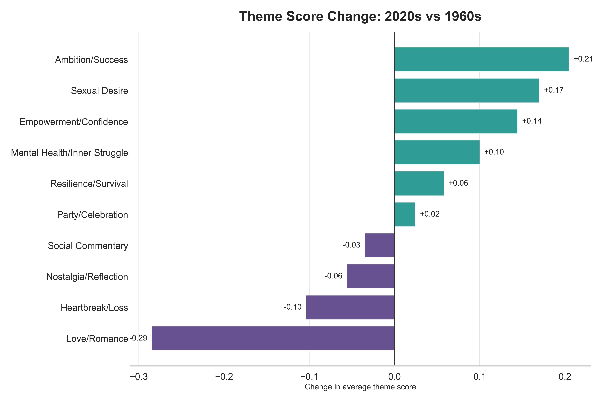
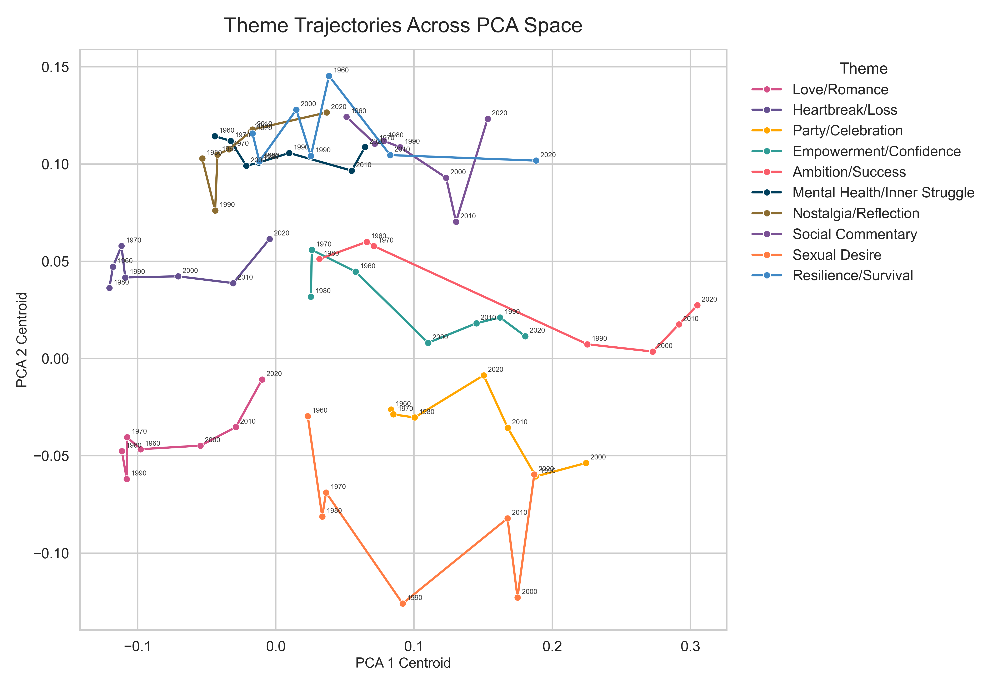

# Has Pop Music Changed Over Time?
*By Patrick Hernandez and Jillian Pizza*

For decades, love songs dominated the Billboard charts; romance, heartbreak, and emotional devotion defined mainstream pop music for generations. As popular music has evolved alongside technological, cultural, and social changes, the emotional focus of mainstream songs may have shifted as well. Are today’s biggest hits still centered on relationships in the same way they once were, or has the thematic landscape of pop music shifted toward something different?

To explore these changes, our project categorized the lyrics of Billboard Hot 100 top-50 songs from the 1960s through the 2020s using ten thematic labels—Love/Romance, Heartbreak/Loss, Party/Celebration, Empowerment/Confidence, Ambition/Success, Mental Health/Inner Struggle, Nostalgia/Reflection, Social Commentary, Sexual Desire, and Resilience/Survival—to examine how the emotional and thematic focus of mainstream pop music has changed over time.

  
*Each line represents the temporal change in the average score for one lyrical theme, showing how the relative prominence of that theme has shifted from the 1960s to the 2020s. Love/Romance has steadily declined over time, while themes such as Ambition/Success, Sexual Desire, Empowerment/Confidence, and Mental Health/Inner Struggle have become comparatively more prominent.**

### Romance’s reign is steadily waning
In the 1960s, love songs dominated with an average confidence score of 0.59. By the 2020s, it’s just 0.31. Heartbreak/Loss has also dropped .10 to about 0.25. Love and heartbreak still matter, but songs centering ambition, self-assurance, sexuality, and emotional struggle are increasingly taking the spotlight, reshaping the charts. 

Not every trend follows a steady trajectory. Party/Celebration music surged during the 2000s and 2010s, reflecting the dominance of dance-pop, club music, and high-energy radio hits, before cooling off in the 2020s (with a slight uptick this past year!). Social Commentary reached its peak in the 1970s and fell to some of its lowest levels in recent decades.

Meanwhile, Nostalgia/Reflection and Resilience/Survival remain comparatively stable across the dataset, suggesting that reflective and perseverance-oriented themes continue to maintain a similar space in mainstream music even as the broader focus of pop music changes over time.

*Change in average theme confidence scores from the 1960s to the 2020s. Positive values indicate themes that became more prominent in recent Billboard songs, while negative values indicate themes that declined. The largest increases are in ambition/success, sexual desire, empowerment/confidence, and mental health/inner struggle, while love/romance shows the largest decline.*

### Pop music became more inward-facing
The largest increases occur in themes centered on selfhood rather than relationships. Ambition/Success rises from roughly 0.03 in the 1960s to 0.24 in the 2020s, while Sexual Desire increases from approximately 0.10 to 0.27. Empowerment/Confidence also more than doubles over the same period, and Mental Health/Inner Struggle becomes substantially more visible in modern music. Sexual Desire and Mental Health/Inner Struggle are themes that were heavily stigmatized in mainstream pop culture in the 1960s; reflecting broader cultural changes in what audiences view as socially acceptable, relatable, and emotionally authentic. 

*Each point represents the confidence-weighted average PCA position for a theme within a decade, with arrows connecting decades from the 1960s to the 2020s. Themes that appear closer together are more strongly associated within songs during a given period. Over time, the trajectories show changing relationships between themes, particularly the growing overlap between Love/Romance, Sexual Desire, and Party/Celebration in recent decades.*

### Relationships between themes have changed
In earlier decades, Sexual Desire occupied a more separate position from Love/Romance, suggesting that explicit sexuality functioned as a more isolated thematic space within mainstream music. By the 2010s and 2020s, however, Love/Romance moves much closer to Sexual Desire, while Party/Celebration also shifts closer to Sexual Desire during the 1990s through 2010s, reflecting the rise of club-oriented pop, nightlife culture, and dance music. Over time, romance, sexuality, and celebration become increasingly intertwined within mainstream pop music. In the 90s, Empowerment/Confidence and Ambition/Success began to diverge, suggesting that modern empowerment narratives are becoming less closely linked to traditional ideas of material success or achievement than they once were.

The changes in Billboard music reflected in this dataset point toward a broader transformation in how popular culture frames identity, emotion, and personal experience. The rise of themes like Sexual Desire and Mental Health/Inner Struggle reflects changing cultural boundaries around what can be openly expressed in mainstream entertainment; topics that may once have been considered too explicit, vulnerable, or socially taboo for dominant pop radio now appear regularly in some of the most commercially successful songs. Even dominant romantic themes themselves evolve over time, becoming more closely intertwined with sexuality and celebration in contemporary music. 

These changes might be due to shifts in consumption modes. Earlier eras of pop music were shaped by shared mass-media experiences such as radio, television, and physical album sales, in which listeners consumed a relatively common cultural product simultaneously. In contrast, contemporary music consumption is increasingly personalized, algorithmically curated, and integrated into digital self-presentation. Streaming platforms, recommendation systems, and social media encourage emotionally immediate and identity-driven songs that listeners can easily incorporate into playlists, short-form videos, captions, edits, and other forms of online expression. These technological changes may also help explain why themes centered on selfhood become more prominent over time; songs focused on confidence, desire, mental health, and personal struggle are relatable individual emotions that can now be consumed more easily in isolation.

*Source data: [Billboard Hot 100 (Top 50)](https://www.billboard.com/charts/hot-100/)*